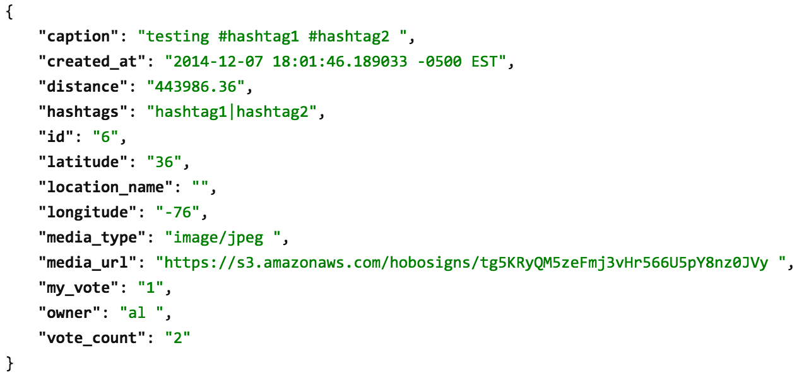

###Hobo Signs Server API Documentation

**General response format:**

When using any part of the API I wrote, you'll get a JSON object as a response. That JSON object has three fields, "success", "error", and "response".
- success - This is a boolean value that indicates whether the requested action was successfully performed (e.g. if a user created an account successfully)
- error - If an error occurred, this field will contain a string giving you a reason why the error occurred. If the request was successful, this field will be null.
- response - This is a JSON object that contains the data you requested. For instance, when using the "login" call, the response field will return a string with the user's access token. If "get_posts" is called, this field will return a JSON object containing a list of the posts that were requested.

**About responses containing user posts:**
- Many of the API calls below return lists of user posts. Each post will have the following properties:
	- caption: 256 character descriptive field about the post content
	- created_at: a timestamp with the timezone specifying when the post was created
	- distance: the distance in meters from the provide latitude/longitude
	- hashtags: a pipe-separated list of hashtags associated with the post (e.g. "hashtag1|tag2|tag3")
	- id: the unique post id (integer)
	- image_url: a url pointing to the image associated with the post content
	- latitude: the latitude of the post location
	- longitude: the longitude of the post location
	- owner: the username of the person who made the post

**Sample Post JSON Object:**

**About the access_token field:**
- This is a unique identifier for each user that is required for many parts of the API call. When a user logs in, they will get an access token assigned to them that allows them to perform actions in our application. When a user logs out, the access token is destroyed.
- A sample access token will look something like "17AmMXZIZyFpZCWOQ1cR7U2KapLwDZh4"

##API Calls

**Creating an Account:**
- This API call creates a new user account.
- HTTP POST to /create_account
- Requires the following fields:
	- username (20 character limit)
	- password (20 character limit)
	- password_confirm (this is the same value as the password field, it is used to make the user enter their password twice, so they know what their password is)
- **Response Data:** None

**Logging In:**
- This API call logs a user into the application. It will validate the username and password fields and create a new session on the server.
- HTTP POST to /login
- Requires the following fields:
	- username
	- password
- **Response Data:** the user's access_token in string form 

**Logging Out:**
- This API call logs a user out of the application by closing his or her session on the server.
- HTTP POST to login
- Requires the following fields:
	- access_token
- **Response Data:** None

**Checking if a User Is Logged In:**
- This API call checks if a user is currently logged in by validating their access token.
- HTTP GET to /is_logged_in
- Requires the following URL parameters:
	- access_token
- **Response Data:** boolean value indicating whether or not the user is logged in

**Adding a Post:**
- This API call adds a post on behalf of a user. All hashtags will be parsed out of the caption field and processed. This API call resizes images on the server before saving them, but for best results **resize and compress all images before using this API call.**
- HTTP POST to /add_post
- Requires the following fields:
	- access_token
	- latitude (e.g. 40.39)
	- longitude (e.g. -76.0353)
	- caption (256 character limit)
	- image
		- This field contains the image data. The associated Content-Type must be "image/jpeg." See file_upload.html for example usage.
- **Response Data:** None

**Getting Posts via Range Query:**
- This API call returns all posts within the specified radius of the specified location.
- HTTP GET to /get_posts
- Requires the following query parameters:
	- access_token
	- latitude
	- longitude
	- radius (radius must be specified in meters)
- **Response Data:** a JSON object containing a list of posts

**Getting the Current User's Posts:**
- This API call returns all posts made by the current user.
- HTTP GET to /my_posts
- Requires the following query parameters:
	- access_token
	- latitude
	- longitude
- **Response Data:** a JSON object containing a list of posts

**Getting Posts By Hashtag:**
- This API call returns all posts containing the specified hashtag.
- HTTP GET to /get_posts_with_hashtag
- Requires the following query parameters:
	- access_token
	- latitude
	- longitude
	- hashtag (without the '#', e.g. "android")
- **Response Data:** a JSON object containing a list of posts

**Getting a List of Hashtags:**
- This API call returns a list of hashtags sorted by their number of posts in descending order. The response will be a list of JSON objects containing a 'hashtag' field and a 'num_posts' field. The 'num_posts' field is an integer equal to the number of posts that contain the particular hashtag.
- HTTP GET to /hashtags
- Requires the following query parameters:
	- access_token
- **Response Data:** a JSON object containing a list of hashtags

***IMPORTANT: for all HTTP Post requests, I have only ensured the functionality works with x-www-form-urlencoded form types***